# Architecture Overview

This diagram represents the clean, modern architecture of the **NexusCommerce** web application.

## System Architecture

```mermaid
graph LR
    %% 1. Client Section
    subgraph Client ["<b>1. Client</b>"]
        direction TB
        C_Web["💻 Web Browser"]
        C_Mob["📱 Mobile Browser"]
    end

    %% 2. Frontend Section
    subgraph Frontend ["<b>2. Frontend (Next.js)</b>"]
        direction TB
        subgraph FE_Pages ["Pages"]
            P_Home["Home / Product"]
            P_Cart["Cart / Checkout"]
            P_Admin["Admin Panel"]
        end
        FE_State["📦 Cart State"]
        FE_API["🔗 API Client (Axios)"]
    end

    %% 3. Backend Section
    subgraph Backend ["<b>3. Backend API (Express)</b>"]
        direction TB
        BE_Mid["🛡️ Middlewares<br/>(Auth, Validation)"]
        BE_Routes["🚦 Routes<br/>(/auth, /products, /orders...)"]
        BE_Ctrl["🎮 Controllers"]
        BE_Svc["⚙️ Services<br/>(Business Logic)"]
        BE_Repo["🗄️ Repositories<br/>(DB Access)"]
    end

    %% 4. Database Section
    subgraph DB ["<b>4. Database (PostgreSQL)</b>"]
        direction TB
        DB_Tables["📋 Tables<br/>Users, Products, Categories,<br/>Orders, OrderItems"]
    end

    %% 5. External Section
    subgraph Ext ["<b>5. External Services</b>"]
        direction TB
        E_Notify["📧 Notifications<br/>(Email/SMS/WhatsApp)"]
        E_Storage["🖼️ File Storage<br/>(Cloudinary/S3)"]
    end

    %% Standard Request Flow (Solid Arrows)
    C_Web & C_Mob ==> FE_Pages
    FE_Pages ==> FE_API
    FE_API ==> BE_Mid
    BE_Mid ==> BE_Routes
    BE_Routes ==> BE_Ctrl
    BE_Ctrl ==> BE_Svc
    BE_Svc ==> BE_Repo
    BE_Repo ==> DB_Tables
    
    %% Return Flow (Implicit via Bi-directional or logic)
    %% To keep it clean, we use bi-directional logic in descriptions

    %% Admin Flow (Dashed Arrows)
    P_Admin -.-> BE_Routes
    BE_Routes -.-> DB_Tables

    %% External Connections
    BE_Svc --> E_Notify
    BE_Svc --> E_Storage

    %% Global Styling
    classDef default fill:#ffffff,stroke:#333333,stroke-width:1px,color:#000000,rx:5,ry:5;
    classDef container fill:#fcfcfc,stroke:#dddddd,stroke-width:1px,stroke-dasharray: 5 5;
    classDef highlight fill:#ffffff,stroke:#007bff,stroke-width:2px;
    classDef dbStyle fill:#fafafa,stroke:#28a745,stroke-width:2px;

    class Client,Frontend,Backend,DB,Ext container;
    class FE_Pages,BE_Routes highlight;
    class DB_Tables dbStyle;
```

### Request Flow Summary

1.  **Standard User Flow** (`==>`):
    *   **Client** interacts with **Next.js Pages**.
    *   **Frontend** manages state (Cart) and uses **Axios** to send requests.
    *   **Backend** processes requests through **Middlewares** (JWT Auth) and **Routes**.
    *   **Controllers** hand off to **Services** (Logic).
    *   **Repositories** query the **Database**.
    *   Response travels back through the same layers to the **Client**.

2.  **Admin Flow** (`-.->`):
    *   **Admin UI** targets specific **Admin Routes**.
    *   Direct data manipulation via specialized controllers/services to the **Database**.

3.  **External Integrations**:
    *   **Backend Services** trigger notifications (Email/SMS) and handle file uploads (Images) to external storage.
