# Architecture Deep Dive: NexusCommerce

This document provides a comprehensive overview of the **NexusCommerce** architecture, covering high-level system design, detailed data flows, authentication logic, and frontend structure.

---

## 1. High-Level System Architecture

The core infrastructure follows a decoupled Client-Server model with a dedicated Backend API and relational database.

```mermaid
graph LR
    %% 1. Client Section
    subgraph Client ["<b>1. Client</b>"]
        direction TB
        C_Web["💻 Web Browser"]
        C_Mob["📱 Mobile Browser"]
    end

    %% 2. Frontend Section
    subgraph Frontend ["<b>2. Frontend (Next.js)</b>"]
        direction TB
        subgraph FE_Pages ["Pages"]
            P_Home["Home / Product"]
            P_Cart["Cart / Checkout"]
            P_Admin["Admin Panel"]
        end
        FE_State["📦 Cart State"]
        FE_API["🔗 API Client (Axios)"]
    end

    %% 3. Backend Section
    subgraph Backend ["<b>3. Backend API (Express)</b>"]
        direction TB
        BE_Mid["🛡️ Middlewares<br/>(Auth, Validation)"]
        BE_Routes["🚦 Routes<br/>(/auth, /products, /orders...)"]
        BE_Ctrl["🎮 Controllers"]
        BE_Svc["⚙️ Services<br/>(Business Logic)"]
        BE_Repo["🗄️ Repositories<br/>(DB Access)"]
    end

    %% 4. Database Section
    subgraph DB ["<b>4. Database (PostgreSQL)</b>"]
        direction TB
        DB_Tables["📋 Tables<br/>Users, Products, Categories,<br/>Orders, OrderItems"]
    end

    %% 5. External Section
    subgraph Ext ["<b>5. External Services</b>"]
        direction TB
        E_Notify["📧 Notifications<br/>(Email/SMS/WhatsApp)"]
        E_Storage["🖼️ File Storage<br/>(Cloudinary/S3)"]
    end

    %% Flows
    C_Web & C_Mob ==> FE_Pages
    FE_Pages ==> FE_API
    FE_API ==> BE_Mid
    BE_Mid ==> BE_Routes
    BE_Routes ==> BE_Ctrl
    BE_Ctrl ==> BE_Svc
    BE_Svc ==> BE_Repo
    BE_Repo ==> DB_Tables
    
    P_Admin -.-> BE_Routes
    BE_Routes -.-> DB_Tables

    BE_Svc --> E_Notify
    BE_Svc --> E_Storage

    %% Global Styling - Optimized for GitHub (Light/High-Contrast)
    classDef default fill:#ffffff,stroke:#000000,stroke-width:1px,color:#000000,rx:5,ry:5;
    classDef container fill:#ffffff,stroke:#cccccc,stroke-width:1px,stroke-dasharray: 5 5;
    classDef highlight fill:#f8f9fa,stroke:#007bff,stroke-width:1.5px;
    classDef dbStyle fill:#f8f9fa,stroke:#28a745,stroke-width:1.5px;

    class Client,Frontend,Backend,DB,Ext container;
    class FE_Pages,BE_Routes highlight;
    class DB_Tables dbStyle;
```

---

## 2. Authentication Flow (JWT)

A secure, stateless authentication mechanism using JSON Web Tokens (JWT).

```mermaid
sequenceDiagram
    autonumber
    participant User as 👤 Client (Browser)
    participant NextJS as 🌐 Frontend (Next.js)
    participant AuthAPI as 🛡️ Auth Route / Middleware
    participant Controller as 🎮 Auth Controller
    participant DB as 🗄️ Database
    
    User->>NextJS: Enters credentials (Email/Pass)
    NextJS->>AuthAPI: POST /api/auth/login
    AuthAPI->>Controller: Validates Payload
    Controller->>DB: Check if User exists & Hash matches
    DB-->>Controller: User Record Found
    Controller->>Controller: Generates JWT (signed with Secret)
    Controller-->>NextJS: Sends JWT in HttpOnly Cookie or Response
    NextJS-->>User: Redirect to Dashboard / Home
    
    Note over User,DB: Subsequent Protected Requests
    User->>AuthAPI: GET /api/orders (Includes JWT)
    AuthAPI->>AuthAPI: Verify JWT Signature & Expiry
    AuthAPI-->>Controller: Proceed to Business Logic
```

---

## 3. Detailed Data & Logic Flow

Explaining how data transforms from the database to the user interface.

---

## 4. Frontend Component Architecture

Modular structure for the Next.js application ensuring scalability and separation of concerns.

---

### Layer Responsibilities

| Layer | Responsibility |
| :--- | :--- |
| **Pages** | Route definitions and data fetching (SSR/Client-side). |
| **Components** | Pure UI logic, reusable styles, and atomic elements. |
| **Context/Store** | Global state management (Auth user, items in shopping cart). |
| **Controllers** | Parsing request parameters, handling HTTP status codes. |
| **Services** | Core business logic (Applying discounts, calculating taxes). |
| **Repositories** | Direct database interaction (Clean SQL queries or ORM calls). |
| **Middlewares** | Cross-cutting concerns like logging, auth, and error handling. |
